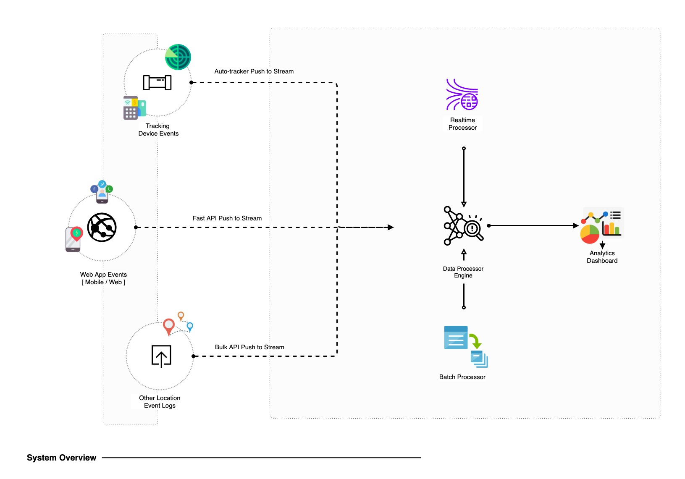
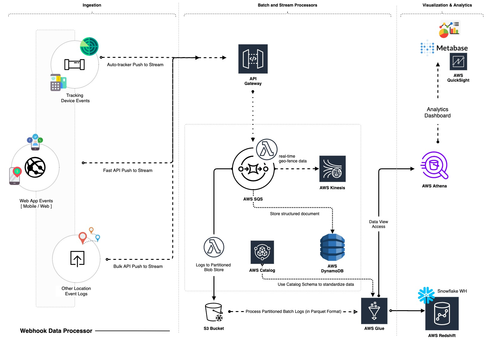

# Webhook Data Processor

## Overview
This project implements a **Webhook Data Processor** designed for handling location-based webhook events efficiently using AWS services. The system ensures scalability, fault tolerance, and cost efficiency.

## Features
- **Receives webhook events** containing location and trip data.
- **Stores raw payloads** in AWS S3 for debugging and auditing.
- **Processes structured location data** and stores it in a NoSQL database.
- **Streams geofence events** to a real-time processing system.
- **Supports analytics and visualization** via Amazon Redshift, Snowflake, and QuickSight.

## Architecture
The system currently runs on a simple server setup but can be modified to utilize a **serverless architecture** powered by AWS:



1. **API Gateway** receives webhook events.
2. **AWS Lambda** validates and processes incoming data.
3. **Amazon SQS** decouples API handling from processing.
4. **Second Lambda function**:
   - Stores raw payloads in **AWS S3**.
   - Writes structured data to **AWS DynamoDB** or **MongoDB**.
   - Streams geofence events to **Amazon Kinesis** for real-time analytics.
5. **AWS Glue** processes batch data and loads it into **Amazon Redshift** or **Snowflake**.
6. **Visualization** with **Amazon QuickSight** or **Metabase**.
7. **Monitoring** with **AWS CloudWatch** and **AWS X-Ray**.



## Meeting Non-Functional Requirements
### **1. Scalability & Fault Tolerance**
- **API Gateway + Lambda** ensures auto-scaling.
- **SQS** prevents data loss with dead-letter queue support.
- **DynamoDB / MongoDB** for low-latency lookups.
- **S3 Storage** for durable event logs.
- **Kinesis** for real-time streaming.

### **2. Monitoring & Security**
- **CloudWatch & X-Ray** provide observability.
- **API Gateway authentication** using JWT/API keys.
- **Data encryption** with **AWS KMS** (at rest) and **TLS** (in transit).

## Future Enhancements
- Implement **dead-letter queue** to retry failed webhook events.
- Integrate **AWS SageMaker** for anomaly detection in geofence behavior.
- Add **unit tests** for robustness.

## Assumptions
- Strictly AWS-based solution.
- Structured data format for **location**, **trip**, and **user** records.
- Sample data format may differ from test data in code.

## Sample Data Structure
```json
{
  "location": {
    "user_id": "12345",
    "latitude": 37.7749,
    "longitude": -122.4194,
    "created_at": "2025-02-09T12:34:56Z",
    "event_type": "location_update"
  },
  "trip": {
    "trip_id": "trip123",
    "external_id": "ext456",
    "user_id": "12345",
    "created_at": "2025-02-09T12:00:00Z",
    "updated_at": "2025-02-09T12:30:00Z",
    "started_at": "2025-02-09T12:10:00Z",
    "route_session_type": "normal"
  },
  "user": {
    "user_id": "12345",
    "event_id": "event789",
    "created_at": "2025-02-09T12:34:56Z",
    "live": true
  }
}
```

## Installation

### Prerequisites

-   **Python** >= 3.8
-   **Poetry**: Dependency manager for Python

If you don't have Poetry installed, you can install it by running:

bash

CopyEdit

`curl -sSL https://install.python-poetry.org | python3 -` 

After installation, verify Poetry is installed by running:

bash

CopyEdit

`poetry --version` 

### Setting up the Environment

1.  Clone this repository:
    `git clone <repository_url> cd <project_directory>` 
    
2.  Install the dependencies using **Poetry**:
   
    `poetry install` 
    
 This will automatically set up the virtual environment and install all the necessary dependencies.
    

### Configuration

Before running the application, ensure you have set the environment variables in a `.env` file. Create a `.env` file in the root of the project with the following contents:

`AWS_ACCESS_KEY_ID=your_aws_access_key_id
AWS_SECRET_ACCESS_KEY=your_aws_secret_access_key
AWS_DEFAULT_REGION=us-east-1
AWS_BUCKET_NAME=your_bucket_name
SNOWFLAKE_USER=your_snowflake_user
SNOWFLAKE_PASS=your_snowflake_password
SNOWFLAKE_ACCOUNT=your_snowflake_account
SNOWFLAKE_DB=your_snowflake_database
SNOWFLAKE_SCHEMA=your_snowflake_schema
SNOWFLAKE_WH=your_snowflake_warehouse` 

**Note**: Replace the placeholders with your actual AWS and Snowflake credentials.

## Running the Application


This task needs to run on a Linux/Unix based operating system with access to the Bash shell. Any Linux distro, MacOS or [WSL instance](https://ubuntu.com/tutorials/install-ubuntu-on-wsl2-on-windows-11-with-gui-support#1-overview) should work fine.

You'll need to install **[Poetry (Python dependency manager)](https://python-poetry.org/docs/)** to run and develop the assignment. Once installed you can see if your solution is working by running.

```bash
poetry install
```
To install required dependencies and set up your virtual environments. Then run the application with:

```bash
poetry run bash run_test.sh
```

## Usage

The application listens for incoming POST requests at `/webhook-endpoint`.

The data sent to this endpoint should be in the following format:
`{
  "id": "64d28b9f7a2fd90012d16fcc",
  "created_at": "2023-08-08T18:38:23.400Z",
  "live": "TRUE",
  "type": "user.updated_trip",
  "_id": "646e94a5be2c8d00504f9928",
  "MMUserId": "61947963940bbe643baf76d9",
  "location": {
    "type": "Point",
    "coordinates": {
      "longitude": "-120.2302705",
      "latitude": "36.923764"
    }
  },
  "trip": {
    "_id": "64d28078c0350b0050c026fc",
    "externalId": "1e8dec71-567e-4ae8-bbb4-aab57082ddcc",
    "createdAt": "2023-08-08T17:50:48.793Z",
    "updatedAt": "2023-08-08T17:50:48.793Z",
    "MMUserId": "61947963940bbe643baf76d9",
    "startedAt": "2023-08-08T17:50:48.793Z",
    "metadata": {
      "route_session_type": "64bebf32d38530406ca4f254"
    }
  }
}` 

Upon receiving the data, the application will:

1.  Parse the webhook and store the raw data in SQLite.
2.  Extract the structured data and store it in the `location_data` table.
3.  Push the structured data to an S3 bucket.
4.  Optionally push data to Snowflake and Kinesis if required.


## Dependencies

-   **Flask**: Web framework for building the API.
-   **boto3**: AWS SDK for interacting with AWS services (S3, Kinesis).
-   **snowflake-connector-python**: Snowflake Python connector.
-   **python-dotenv**: For loading environment variables from a `.env` file.
-   **sqlite3**: Lightweight database used to store incoming webhook data.
-   **pytest**: Testing framework.

These dependencies are managed using **Poetry**. To add or update dependencies, you can use the following commands:

`poetry add <package_name>
poetry update` 